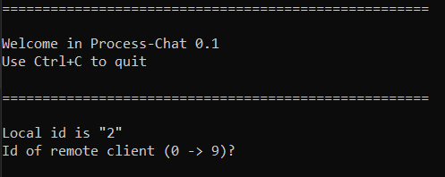
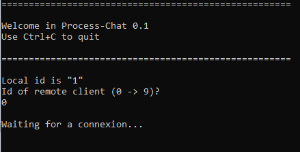
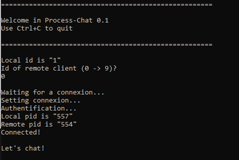

# Process_chat

A Linux inter-process chat application using named pipes and signals.

## Getting started

### Prerequisites

The source code can be compiled using make and gcc.
We recommand the installation of package **build-essential**:
```
apt-get update && apt-get install build-essential
```
### Installing

Navigate to the root folder, then build the project using **make**:
```
make
```

## Utilisation

### Clients

There is no server concept in this application. Several clients can connect by themselves one to each other. Every client can connect to only one other client at a time. 10 clients can run at the same time on a given plateform. Every client is the same program. As such, you can just duplicate the **client** executable file into **client1**, **client2**, **client3**, etc.

### Starting a client

Provided no error occured, the following output should appear in the terminal:



Each instance will display its **id** on startup. To start chating, enter the **id** of the instance you want to etablish a connexion with.



Do the same for the remote instance. Once both instances are successfully connected, ou may start chating:

